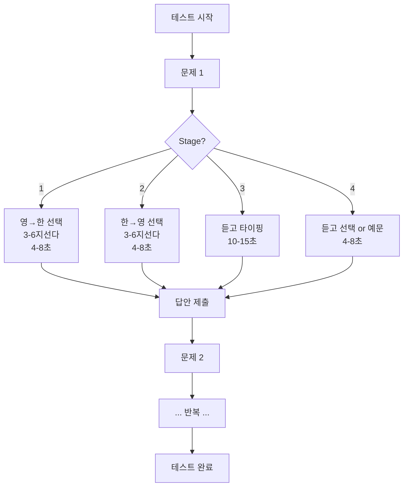
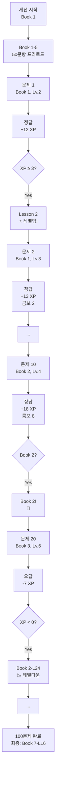

# 스테이지 테스트 vs 마스터리 테스트 상세 비교

**작성일**: 2026-02-12
**목적**: 두 시스템의 차이점을 명확히 이해하고 적절한 활용 방안 제시

---

## 🎯 핵심 차이점 한눈에 보기

| 구분 | 스테이지 테스트 | 마스터리 레벨업 |
|-----|---------------|----------------|
| **본질** | 학습 도구 | 평가 도구 |
| **목적** | 단어 반복 학습으로 완전 숙달 | 학생의 어휘 수준 실시간 판정 |
| **진행 방식** | 스테이지별 순차 학습 (1→2→3→4) | XP 획득으로 레벨 상승 (RPG) |
| **난이도 조절** | 레벨별 4단계 차등 | XP 기반 실시간 적응 |
| **세션 길이** | 고정 문항 수 | 50~100 문항 |
| **반복 학습** | 동일 단어 반복 출제 | 각 단어 1회만 |
| **완료 조건** | 문항 수 완료 | 문항 수 완료 |
| **최종 목표** | 단어 마스터 | 레벨 판정 |

---

## 📚 1. 스테이지 테스트 (Stage Test)

### 1.1 목적 및 철학

**"완전 학습(Mastery Learning)"**

- 각 단어를 **반복 학습**하여 완벽히 숙달
- 스테이지를 통한 **점진적 난이도 상승**
- "알 때까지 반복" 원칙

### 1.2 스테이지 시스템

#### Stage 1: word_to_meaning (영→한 선택)
- **난이도**: ⭐ 쉬움
- **문제 유형**: 영어 단어 → 한국어 뜻 선택
- **선택지**: 레벨별 3~6개
- **타이머**: 레벨별 4~8초
- **목적**: 단어 인식 (수동적 어휘)

#### Stage 2: meaning_to_word (한→영 선택)
- **난이도**: ⭐⭐ 보통
- **문제 유형**: 한국어 뜻 → 영어 단어 선택
- **선택지**: 레벨별 3~6개
- **타이머**: 레벨별 4~8초
- **목적**: 단어 회상 (능동적 어휘)

#### Stage 3: listen_and_type (듣고 타이핑)
- **난이도**: ⭐⭐⭐ 어려움
- **문제 유형**: 발음 듣고 영어 타이핑
- **타이머**: 레벨별 10~15초
- **목적**: 철자 암기 + 듣기 능력

#### Stage 4: listen_to_meaning + sentence (듣고 선택 + 예문)
- **난이도**: ⭐⭐⭐⭐ 매우 어려움
- **문제 유형**:
  - 기본: 발음 듣고 한국어 뜻 선택
  - 고급: 예문 빈칸 채우기
- **선택지**: 레벨별 3~6개
- **타이머**: 레벨별 4~8초
- **목적**: 문맥 이해 + 실전 활용

### 1.3 레벨별 차등 시스템

#### 최소 스테이지 (강제 난이도 상승)
```
Lv.1-2  : Stage 1부터 시작 가능
Lv.3-4  : 최소 Stage 2 (쉬운 문제 제외)
Lv.5-6  : 최소 Stage 3 (타이핑 시작)
Lv.7-9  : 최소 Stage 4 (듣기+선택)
Lv.10-15: Stage 4 or 5만 (최고난이도)
```

**효과**: 고레벨 단어는 자동으로 어려운 문제 유형

#### 선택지 개수 (객관식 난이도)
```
Lv.1-2 : 3지선다 (33% 찍기 확률)
Lv.3-4 : 4지선다 (25%)
Lv.5-7 : 5지선다 (20%)
Lv.8-15: 6지선다 (17%)
```

**효과**: 레벨이 높을수록 헷갈리는 선택지 증가

#### 타이머 제한 (시간 압박)
```
[선택형 문제]
Lv.1-2 : 8초
Lv.3-4 : 7초
Lv.5-6 : 6초
Lv.7-9 : 5초
Lv.10-15: 4초

[타이핑 문제]
Lv.1-4 : 15초
Lv.5-8 : 12초
Lv.9-15: 10초
```

**효과**: 고레벨은 빠른 판단력 요구

#### 타이핑 강제 확률 (Stage 1-2에서)
```
Lv.1-3 : 0%  (항상 선택형)
Lv.4-5 : 15% (가끔 타이핑)
Lv.6-7 : 30%
Lv.8-9 : 45%
Lv.10-15: 60% (자주 타이핑)
```

**효과**: 고레벨은 초반부터 타이핑 연습

#### 예문 출제 확률
```
Lv.1-4 : 5%  (거의 단어만)
Lv.5-7 : 15%
Lv.8-10: 30%
Lv.11-15: 50% (절반이 예문)
```

**효과**: 고레벨은 문맥 이해 중시

### 1.4 진행 흐름



### 1.5 데이터 모델

```typescript
// 프론트엔드 상태
{
  currentQuestion: {
    word: { english, korean, level },
    stage: 1-4,  // 현재 스테이지
    question_type: "word_to_meaning" | "meaning_to_word" | "listen_and_type" | "listen_to_meaning",
    choices: ["선택지1", "선택지2", ...],
    timer_seconds: 4-15,  // 레벨별 차등
    context_mode: "word" | "sentence"
  },
  answeredCount: 0,
  correctCount: 0,
  currentStage: 1-4,
  currentLevel: 1-15
}
```

```sql
-- 백엔드 DB
learning_session
├── current_stage: 1-4 (현재 스테이지 - 표시용)
├── current_level: 1-15 (현재 레벨 - 표시용)
├── words_practiced: 문항 수
└── words_advanced: 정답 수

word_mastery (각 단어마다)
├── stage: 1-5 (개별 단어의 스테이지)
├── stage_streak: 연속 정답 횟수
└── mastered_at: 완전 숙달 시점
```

### 1.6 사용 시나리오

**적합한 경우**:
- ✅ 특정 교재/레슨의 단어 학습
- ✅ 신규 단어 암기 (수업 후 숙제)
- ✅ 약점 단어 집중 학습
- ✅ 장기간 반복 학습

**부적합한 경우**:
- ❌ 빠른 레벨 판정
- ❌ 전체 어휘력 평가
- ❌ 배치테스트

---

## 🎮 2. 마스터리 레벨업 (Mastery Level-up)

### 2.1 목적 및 철학

**"적응형 능력 판정(Adaptive Assessment)"**

- 학생의 **현재 어휘 수준을 실시간 판정**
- RPG 방식 레벨업으로 **동기부여**
- "실력에 맞는 난이도 자동 조절"

### 2.2 XP (경험치) 시스템

#### 레벨 구조
```
15개 Book (교재)
├── Book 1 ~ Book 15
├── 각 Book = 25 Lesson
└── 총 375개 서브레벨 (15 × 25)

예시:
- Book 1 - Lesson 1 (초급)
- Book 7 - Lesson 16 (중급)
- Book 15 - Lesson 25 (최상급)
```

#### 랭크 매핑
```
Book 1-2  : Iron (철)
Book 3    : Bronze (동)
Book 4    : Silver (은)
Book 5-6  : Gold (금)
Book 7-8  : Platinum (백금)
Book 9    : Diamond (다이아)
Book 10   : Master (마스터)
Book 11-12: Grandmaster (그랜드마스터)
Book 13-14: Legend (레전드)
Book 15   : Challenger (챌린저)
```

#### XP 획득 공식

**기본 XP (정답)**:
```javascript
if (questionLevel >= currentBook) {
  baseXP = 8 + currentBook * 2;  // 같거나 높은 레벨
} else {
  baseXP = Math.max(4, currentBook);  // 낮은 레벨
}
```

**속도 보너스**:
| 시간 | 보너스 | 예시 |
|-----|-------|------|
| ≤ 1s | +5 XP | 즉답 |
| ≤ 2s | +4 XP | 매우 빠름 |
| ≤ 3s | +3 XP | 빠름 |
| ≤ 5s | +2 XP | 보통 |
| ≤ 8s | +1 XP | 약간 느림 |
| > 8s | +0 XP | 느림 |

**콤보 보너스**:
| 연속 정답 | 보너스 | 상태 |
|----------|-------|------|
| 3-4연속 | +1 XP | 🔥 |
| 5-6연속 | +2 XP | 🔥🔥 |
| 7-9연속 | +3 XP | 🔥🔥🔥 |
| 10-14연속 | +5 XP | 🔥🔥🔥🔥 |
| 15+ 연속 | +5 XP | 🔥🔥🔥🔥🔥 |

**오답 페널티**:
```javascript
basePenalty = -(4 + currentBook);

if (consecutiveWrong >= 3) {
  penalty = basePenalty * 2.0;  // -8, -10, -12...
} else if (consecutiveWrong >= 2) {
  penalty = basePenalty * 1.5;  // -6, -7.5, -9...
} else {
  penalty = basePenalty * 1.0;  // -4, -5, -6...
}
```

#### 레벨 진화

**레벨 업**:
```javascript
lessonXP = 2 + currentBook;  // Book 1: 3, Book 2: 4, ..., Book 15: 17

while (xp >= lessonXP && currentBook <= 15) {
  xp -= lessonXP;
  currentLesson++;

  if (currentLesson > 25) {
    currentBook++;      // 다음 Book!
    currentLesson = 1;
  }
}
```

**레벨 다운**:
```javascript
while (xp < 0 && (currentBook > 1 || currentLesson > 1)) {
  if (currentLesson > 1) {
    currentLesson--;
  } else {
    currentBook--;
    currentLesson = 25;
  }

  // 이전 레슨 XP의 80%에서 시작
  xp = Math.round(lessonXP * 0.8) + xp;
}
```

### 2.3 적응형 난이도 시스템

#### 멀티레벨 문제 풀 (Pre-loading)
```javascript
// 세션 시작 시
currentLevel ~ currentLevel+4, 각 10문항
= 최대 50문항 프리로드

예시 (Book 3):
- Book 3: 10문항
- Book 4: 10문항
- Book 5: 10문항
- Book 6: 10문항
- Book 7: 10문항
총 50문항
```

#### 레벨 변동 시
```javascript
// 정답 연속 → XP 누적 → Book 3 → Book 4
// 이미 Book 4 문항이 로드되어 있음 → 즉시 전환!

// Book 7까지 도달 → Book 7 풀 소진
// → POST /mastery/batch (Book 8-12 lazy fetch)
```

**효과**: 끊김 없는 부드러운 난이도 전환

### 2.4 UI/UX 특징

#### XP 바 (실시간)
```
[████████░░] 12/15 XP
Book 7 - Lesson 16
Platinum Rank ⚪
```

#### 3색 XP 팝업
```
정답 시:
  +12 (초록 - 기본 XP)
  +3  (노랑 - 속도 보너스)
  +2  (청록 - 콤보 보너스)
  ────
  +17 총 XP

Bangers 폰트 + 만화 스타일 외곽선
```

#### 콤보 카운터
```
🔥 5연속
```

#### 레벨업 애니메이션
```
Book 6 → Book 7
Platinum Rank! ⚪
```

### 2.5 진행 흐름



### 2.6 데이터 모델

```typescript
// 프론트엔드 상태 (masteryStore)
{
  currentBook: 1-15,        // 현재 교재
  currentLesson: 1-25,      // 현재 레슨
  xp: 0-17,                 // 현재 레슨 XP
  combo: 0,                 // 현재 콤보
  bestCombo: 0,             // 최고 콤보
  consecutiveWrong: 0,      // 연속 오답
  correctCount: 0,
  totalAnswered: 0,

  // 멀티레벨 풀
  levelPools: {
    1: [Question[], ...],   // Book 1 문항들
    2: [Question[], ...],   // Book 2 문항들
    ...
  },
  poolIndex: {
    1: 3,  // Book 1의 3번째 문제
    2: 0,  // Book 2의 0번째 문제
    ...
  }
}
```

```sql
-- 백엔드 DB
learning_session
├── current_level: 1-15 (최종 Book, 프론트엔드가 전송)
├── best_combo: 최고 콤보 (프론트엔드가 전송)
├── words_practiced: 100
└── words_advanced: 74

-- XP, Book, Lesson은 프론트엔드에서만 관리!
-- 백엔드는 최종 레벨만 저장
```

### 2.7 사용 시나리오

**적합한 경우**:
- ✅ 신규 학생 배치테스트
- ✅ 정기 레벨 평가
- ✅ 실력 변화 추적
- ✅ 빠른 레벨 판정

**부적합한 경우**:
- ❌ 특정 단어 반복 학습
- ❌ 약점 단어 집중 학습
- ❌ 장기간 학습 도구

---

## 🔍 3. 상세 비교표

### 3.1 기술적 비교

| 항목 | 스테이지 테스트 | 마스터리 레벨업 |
|-----|---------------|----------------|
| **계산 위치** | 백엔드 | 프론트엔드 (XP 계산) |
| **상태 관리** | stageTestStore | masteryStore |
| **API 엔드포인트** | `/api/v1/stage-test/*` | `/api/v1/mastery/*` |
| **서비스 로직** | `stage_test.py` | `mastery.py` |
| **엔진** | `mastery_engine.py` | `mastery_engine.py` |
| **모델** | `learning_session` | `learning_session` |
| **DB 필드** | `current_stage` (1-4) | `current_level` (1-15) |
| **문제 생성** | `generate_stage_questions` | `generate_mixed_questions` |
| **난이도 조절** | 레벨별 차등 (4가지) | XP 기반 적응 |

### 3.2 난이도 시스템 비교

| 요소 | 스테이지 테스트 | 마스터리 레벨업 |
|-----|---------------|----------------|
| **기준** | 단어 레벨 (1-15) | 학생 Book (1-15) |
| **조절 방식** | 레벨별 고정 차등 | XP 기반 실시간 |
| **최소 스테이지** | Lv.10+ → Stage 4만 | 없음 (내부 처리) |
| **선택지 개수** | Lv.1-2: 3개, Lv.8+: 6개 | Stage별 자동 |
| **타이머** | Lv.1-2: 8s, Lv.10+: 4s | Stage별 자동 |
| **타이핑 강제** | Lv.10+: 60% 확률 | Stage 3, 5 |
| **예문 출제** | Lv.11+: 50% 확률 | Stage 1 정답 후 |
| **난이도 변경** | 문제마다 (단어 레벨) | XP 변동 시 (Book) |

### 3.3 문제 유형 비교

#### 스테이지 테스트

| Stage | 문제 유형 | 선택지 | 타이머 | 예시 |
|-------|----------|-------|--------|------|
| 1 | word_to_meaning | 3-6개 | 4-8s | abandon → ? |
| 2 | meaning_to_word | 3-6개 | 4-8s | 버리다 → ? |
| 3 | listen_and_type | 없음 | 10-15s | 🔊 → _____ |
| 4 | listen_to_meaning<br/>sentence_blank | 3-6개<br/>4개 | 4-8s<br/>6-10s | 🔊 → ?<br/>I ___ my car. |

**특징**: Stage가 명확히 구분됨, 레벨별 차등 강화

#### 마스터리 레벨업

| Stage | 문제 유형 | 선택지 | 타이머 | 예시 |
|-------|----------|-------|--------|------|
| 1 | word_to_meaning | 4개 | 5s | abandon → ? |
| 1 정답 후 | sentence_review | - | - | 예문 학습 카드 |
| 2 | meaning_to_word | 4개 | 5s | 버리다 → ? |
| 3 | listen_and_type | 없음 | 15s | 🔊 → _____ |
| 4 | listen_to_meaning | 4개 | 10s | 🔊 → ? |
| 5 | meaning_and_type | 없음 | 15s | 버리다 → _____ |

**특징**: Stage는 내부 처리, 사용자는 Book-Lesson만 인지

### 3.4 보상 시스템 비교

| 요소 | 스테이지 테스트 | 마스터리 레벨업 |
|-----|---------------|----------------|
| **정답 보상** | - | +8~20 XP (기본) |
| **속도 보너스** | - | +0~5 XP |
| **콤보 보너스** | - | +0~5 XP |
| **오답 페널티** | - | -4~-16 XP |
| **연속 오답** | - | 페널티 ×1.5~2.0 |
| **레벨업** | - | ⭐ 시각 효과 |
| **레벨다운** | - | 📉 시각 효과 |
| **랭크** | - | Iron ~ Challenger |

**차이**: 스테이지는 보상 없음, 마스터리는 RPG식 보상

### 3.5 UI/UX 비교

| 요소 | 스테이지 테스트 | 마스터리 레벨업 |
|-----|---------------|----------------|
| **진행 표시** | Stage 1-4 아이콘 | XP 바 + Book-Lesson |
| **레벨 표시** | Lv.1-15 (단어) | Book 1-15 (학생) |
| **랭크 배지** | - | Iron~Challenger |
| **콤보 카운터** | - | 🔥 5연속 |
| **XP 팝업** | - | 3색 +17 팝업 |
| **레벨업 효과** | - | ⭐ 애니메이션 |
| **타이머** | 카운트다운 | 카운트다운 + 색상 |
| **정답 피드백** | O/X 표시 | O/X + XP 변동 |

**차이**: 마스터리가 훨씬 화려하고 동기부여 요소 많음

### 3.6 리포트 비교

#### 스테이지 테스트 리포트

**지표**:
- Stage별 정답률
- 레벨별 정답률
- 평균 답변 시간
- 총 소요 시간

**시각화**:
- 막대 그래프 (Stage별)
- 테이블 (레벨별)

#### 마스터리 레벨업 리포트

**지표** (5개):
1. **정확도** (Accuracy): 정답률
2. **속도** (Speed): 평균 답변 시간
3. **콤보** (Combo): 최고 연속 정답
4. **어휘 사이즈** (Vocabulary Size): 누적 단어 수
5. **학습 성장도** (Growth): 레벨 상승폭

**시각화**:
- 레이더 차트 (5지표, 심장 박동 애니메이션)
- 랭크 배지 (그라데이션)
- 메트릭 상세 (진행 바 + 회원 평균 비교)
- 레벨별 정답률 테이블

**차이**: 마스터리 리포트가 훨씬 상세하고 시각적

---

## 💡 4. 활용 가이드

### 4.1 스테이지 테스트 활용

**추천 시나리오**:

1. **교재 진도 학습**
   ```
   상황: 5000 Word - Book 3 - Lesson 1~5 수업 완료
   목적: 해당 범위 단어 완전 숙달
   설정:
   - 레벨 범위: Lv.3
   - 교재: 5000 Word - Book 3
   - 레슨: 1-5
   - 문항: 50문제
   - 시간: 제한 없음

   결과: 4단계 난이도로 완벽히 암기
   ```

2. **약점 단어 집중 학습**
   ```
   상황: 중간고사 틀린 단어 30개
   목적: 약점 단어만 집중 학습
   설정:
   - 특정 단어 ID 리스트
   - 문항: 30문제
   - 반복: 모두 Stage 4 도달할 때까지

   결과: 약점 보완
   ```

3. **숙제 과제**
   ```
   상황: 주간 숙제
   목적: 이번 주 단어 복습
   설정:
   - 레벨 범위: Lv.5-6
   - 문항: 100문제
   - 마감: 일주일

   결과: 꾸준한 반복 학습
   ```

**장점**:
- ✅ 특정 범위 집중 학습
- ✅ 반복으로 완전 숙달
- ✅ 4단계 체계적 학습

**단점**:
- ❌ 전체 레벨 판정 불가
- ❌ 동기부여 요소 부족

### 4.2 마스터리 레벨업 활용

**추천 시나리오**:

1. **신규 학생 배치**
   ```
   상황: 새로 등록한 학생
   목적: 현재 어휘 수준 파악
   설정:
   - 레벨 범위: Lv.1-15 (전체)
   - 문항: 100문제
   - 시간: 60분

   결과: Book 7 (중급) 판정
   → 7-1 교재부터 시작
   ```

2. **분기별 레벨 평가**
   ```
   상황: 3개월 학습 후
   목적: 실력 향상 확인
   설정:
   - 레벨 범위: Lv.1-15
   - 문항: 100문제

   결과:
   - 3개월 전: Book 5
   - 현재: Book 8
   - 성장: +3 Books ⬆️
   ```

3. **경쟁 이벤트**
   ```
   상황: 월말 랭킹전
   목적: 최고 레벨 도전
   설정:
   - 문항: 100문제
   - 리더보드: 최고 Book 순위

   결과: 학생들 동기부여 ⬆️
   ```

**장점**:
- ✅ 빠른 레벨 판정
- ✅ 높은 동기부여
- ✅ 적응형 난이도
- ✅ 상세한 리포트

**단점**:
- ❌ 특정 단어 집중 불가
- ❌ 반복 학습 어려움

### 4.3 조합 활용

**최적의 학습 사이클**:

```
1. 마스터리 레벨업 (월초)
   └─> Book 7 판정

2. 스테이지 테스트 (주간 숙제)
   └─> Book 7 - Lesson 1~5
   └─> Book 7 - Lesson 6~10
   └─> Book 7 - Lesson 11~15
   └─> Book 7 - Lesson 16~20

3. 마스터리 레벨업 (월말)
   └─> Book 8 판정! ⬆️

4. 반복...
```

**효과**:
- ✅ 레벨업으로 동기부여
- ✅ 스테이지로 꾸준한 학습
- ✅ 다시 레벨업으로 성과 확인

---

## 📊 5. 성능 및 데이터 비교

### 5.1 API 호출 횟수

**100문제 기준**:

| 작업 | 스테이지 | 마스터리 |
|-----|---------|---------|
| 세션 시작 | 1회 | 1회 (50문항 프리로드) |
| 문제 fetch | 100회 | 2-3회 (lazy loading) |
| 답안 제출 | 100회 | 100회 |
| 완료 | 1회 | 1회 |
| **총계** | **202회** | **103-104회** |

**결론**: 마스터리가 약 50% 적은 API 호출

### 5.2 DB 쓰기 작업

**100문제 기준**:

| 작업 | 스테이지 | 마스터리 |
|-----|---------|---------|
| session 업데이트 | 100회 | 1회 (최종만) |
| answer INSERT | 100회 | 100회 |
| word_mastery 업데이트 | 100회 | 100회 |
| **총계** | **300회** | **201회** |

**결론**: 마스터리가 약 33% 적은 DB 쓰기

### 5.3 클라이언트 상태 크기

**메모리 사용**:

| 상태 | 스테이지 | 마스터리 |
|-----|---------|---------|
| 현재 문제 | ~2KB | ~2KB |
| 문제 풀 | 0 (즉시 fetch) | ~50KB (50문항) |
| 답안 히스토리 | ~200KB | ~200KB |
| XP 상태 | - | ~1KB |
| **총계** | **~202KB** | **~253KB** |

**결론**: 마스터리가 25% 더 많지만 프리로드 덕분에 부드러움

---

## 🎯 6. 결론 및 권장사항

### 6.1 시스템 선택 가이드

**스테이지 테스트를 선택하세요**:
- 📚 특정 교재/레슨 범위 학습
- 🔁 단어 반복 학습 필요
- 📝 숙제/과제 부여
- 🎯 약점 보완

**마스터리 레벨업을 선택하세요**:
- 🆕 신규 학생 레벨 판정
- 📊 정기 평가
- 🏆 경쟁/이벤트
- ⚡ 빠른 실력 측정

### 6.2 향후 개선 방향

**스테이지 테스트**:
1. SRS 복습 시스템 활성화
2. Stage별 상세 통계
3. 약점 단어 자동 추천

**마스터리 레벨업**:
1. 리더보드 시스템
2. 성취 배지 시스템
3. AI 기반 난이도 예측

### 6.3 최종 평가

| 평가 기준 | 스테이지 | 마스터리 | 우위 |
|----------|---------|---------|------|
| 학습 효과 | ⭐⭐⭐⭐⭐ | ⭐⭐⭐ | 스테이지 |
| 동기부여 | ⭐⭐⭐ | ⭐⭐⭐⭐⭐ | 마스터리 |
| 레벨 판정 | ⭐⭐ | ⭐⭐⭐⭐⭐ | 마스터리 |
| 사용 편의성 | ⭐⭐⭐⭐ | ⭐⭐⭐⭐⭐ | 마스터리 |
| 기술적 효율 | ⭐⭐⭐ | ⭐⭐⭐⭐ | 마스터리 |
| 리포트 품질 | ⭐⭐⭐ | ⭐⭐⭐⭐⭐ | 마스터리 |

**종합 평가**:
- **스테이지 테스트**: 학습 도구로서 우수 (4.2/5.0)
- **마스터리 레벨업**: 평가 도구로서 탁월 (4.7/5.0)

**권장**: 두 시스템을 **조합하여 활용**하는 것이 최상의 학습 효과!

---

**작성**: Claude (Anthropic)
**최종 검토**: 2026-02-12
**버전**: 1.0
