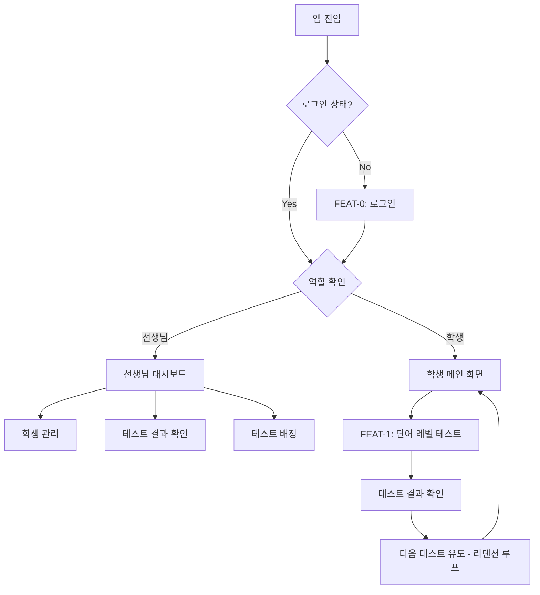
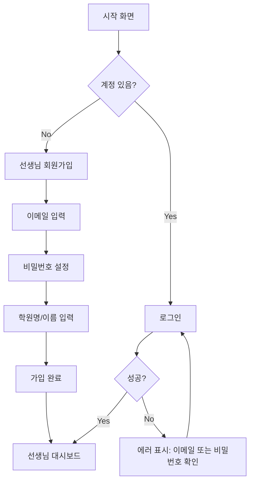
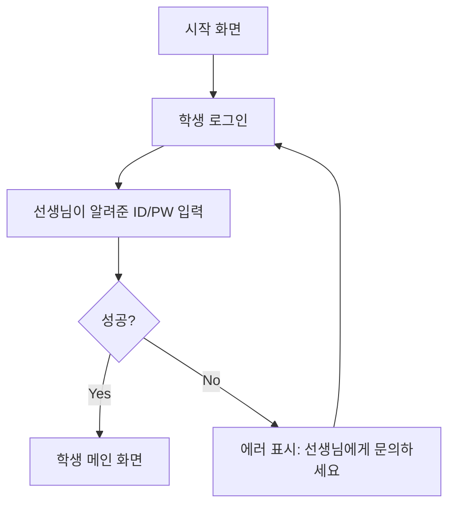
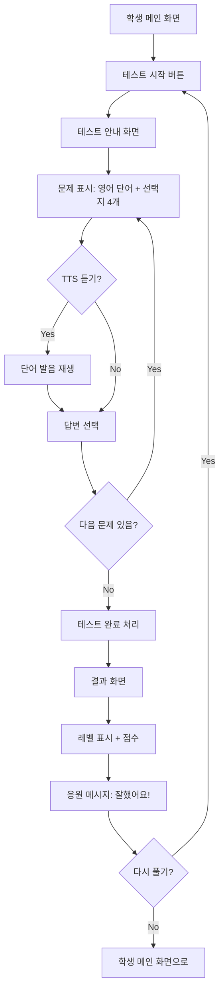
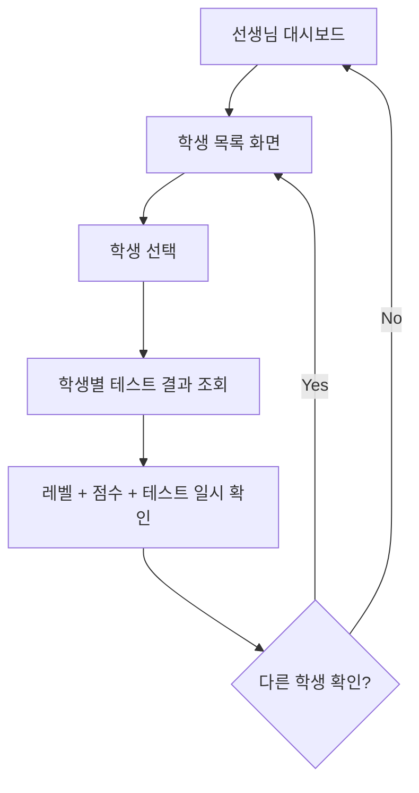
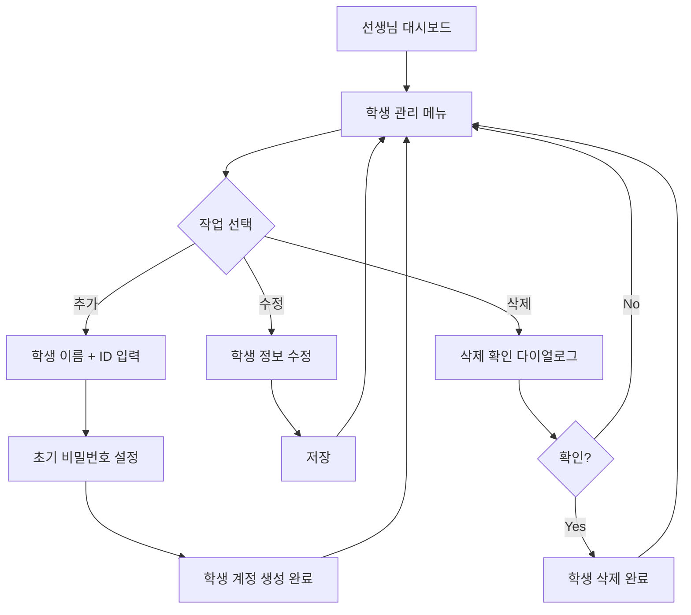
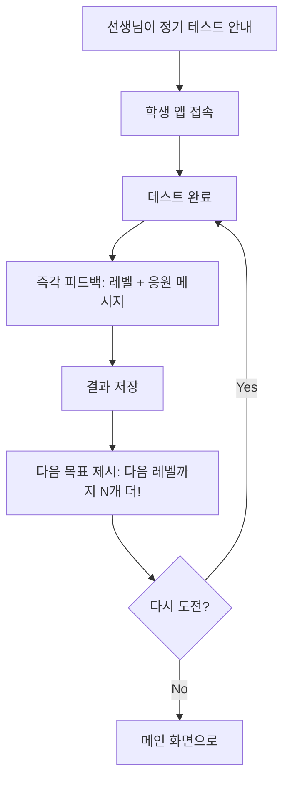
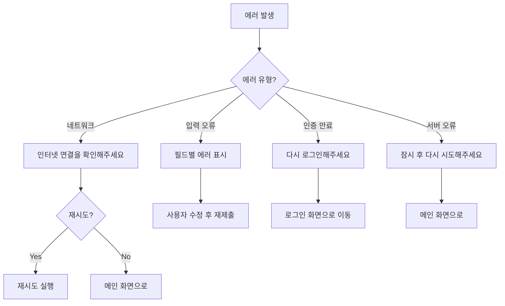

# User Flow (사용자 흐름도)

> Mermaid 플로우차트로 핵심 기능의 주요 여정을 표현합니다.
> 성공/실패 분기를 포함하고, 온보딩→핵심작업→리텐션 루프를 표현합니다.

---

## MVP 캡슐

| # | 항목 | 내용 |
|---|------|------|
| 1 | 목표 | 학생들의 영어 단어 실력을 빠르고 정확하게 테스트하여 레벨별로 분류 |
| 2 | 페르소나 | 학원 선생님(관리자) + 학생(테스트/학습자) |
| 3 | 핵심 기능 | FEAT-1: 단어 레벨 테스트 |
| 4 | 성공 지표 (노스스타) | 주 1회 이상 테스트 참여 학생 비율 |
| 5 | 입력 지표 | ① 신규 학생 테스트 완료율 ② 정기 테스트 참여율 |
| 6 | 비기능 요구 | 모바일+PC 반응형 웹 지원 |
| 7 | Out-of-scope | FEAT-2(리포트/통계), FEAT-3(학습 모드), 다크 모드, 수익화 |
| 8 | Top 리스크 | 학생들이 테스트에 흥미를 잃어 참여율이 낮아질 수 있음 |
| 9 | 완화/실험 | 친근한 톤의 피드백 + TTS로 발음 학습 요소 추가 |
| 10 | 다음 단계 | wordtest.xlsx 데이터 분석 및 레벨 체계 설계 |

---

## 1. 전체 사용자 여정 (Overview)

---

## 2. FEAT-0: 온보딩/로그인 플로우

### 2.1 선생님 플로우

### 2.2 학생 플로우

---

## 3. FEAT-1: 단어 레벨 테스트 플로우

### 3.1 학생 - 테스트 응시

### 3.2 선생님 - 테스트 결과 확인

### 3.3 선생님 - 학생 계정 관리

---

## 4. 리텐션 루프 (습관 형성)

---

## 5. 에러 처리 플로우

---

## 6. 화면 목록 (Screen Inventory)

| 화면 ID | 화면명 | FEAT | 진입점 | 주요 액션 |
|---------|--------|------|--------|----------|
| S-01 | 시작/로그인 화면 | FEAT-0 | 앱 실행 | 로그인 (선생님/학생) |
| S-02 | 선생님 회원가입 | FEAT-0 | S-01 | 계정 생성 |
| S-03 | 선생님 대시보드 | FEAT-0 | S-01 | 학생 관리, 결과 확인 |
| S-04 | 학생 관리 | FEAT-0 | S-03 | 학생 추가/수정/삭제 |
| S-05 | 학생 메인 화면 | - | S-01 | 테스트 시작 |
| S-06 | 테스트 진행 | FEAT-1 | S-05 | 문제 풀기, TTS 듣기 |
| S-07 | 테스트 결과 | FEAT-1 | S-06 | 레벨 확인, 점수 확인 |
| S-08 | 학생별 결과 조회 | FEAT-1 | S-03 | 선생님이 학생 결과 확인 |

---

## Decision Log 참조

| ID | 항목 | 선택 | 영향 |
|----|------|------|------|
| D-03 | 사용자 역할 | 선생님 + 학생 | 화면을 역할별로 분리 |
| D-04 | 사용 환경 | 반응형 웹 | 모든 화면 모바일/PC 대응 |
| D-06 | TTS 연동 | 테스트 화면에 TTS 버튼 | S-06에 TTS 기능 포함 |
| D-07 | UI 톤 | 친근하고 응원 | 결과 화면에 응원 메시지 |
