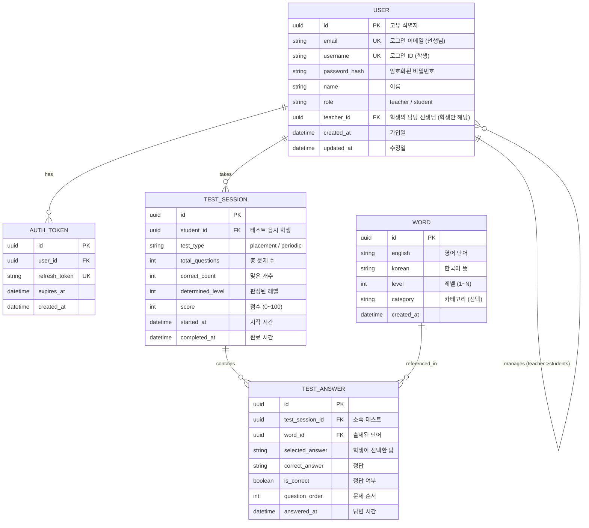
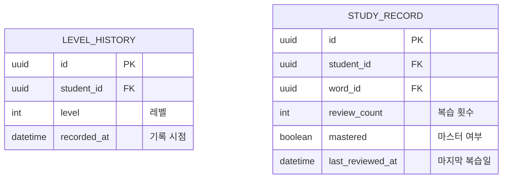

# Database Design (데이터베이스 설계)

> Mermaid ERD로 주요 엔티티와 관계를 표현합니다.
> 각 엔티티에 FEAT 주석을 달아 어떤 기능에서 사용되는지 명시합니다.
> 최소 수집 원칙을 반영하여 불필요한 개인정보는 지양합니다.

---

## MVP 캡슐

| # | 항목 | 내용 |
|---|------|------|
| 1 | 목표 | 학생들의 영어 단어 실력을 빠르고 정확하게 테스트하여 레벨별로 분류 |
| 2 | 페르소나 | 학원 선생님(관리자) + 학생(테스트/학습자) |
| 3 | 핵심 기능 | FEAT-1: 단어 레벨 테스트 |
| 4 | 성공 지표 (노스스타) | 주 1회 이상 테스트 참여 학생 비율 |
| 5 | 입력 지표 | ① 신규 학생 테스트 완료율 ② 정기 테스트 참여율 |
| 6 | 비기능 요구 | 모바일+PC 반응형 웹 지원 |
| 7 | Out-of-scope | FEAT-2(리포트/통계), FEAT-3(학습 모드), 다크 모드, 수익화 |
| 8 | Top 리스크 | 학생들이 테스트에 흥미를 잃어 참여율이 낮아질 수 있음 |
| 9 | 완화/실험 | 친근한 톤의 피드백 + TTS로 발음 학습 요소 추가 |
| 10 | 다음 단계 | wordtest.xlsx 데이터 분석 및 레벨 체계 설계 |

---

## 1. ERD (Entity Relationship Diagram)



---

## 2. 엔티티 상세 정의

### 2.1 USER (사용자) - FEAT-0

| 컬럼 | 타입 | 제약조건 | 설명 |
|------|------|----------|------|
| id | UUID | PK | 고유 식별자 |
| email | VARCHAR(255) | UNIQUE, NULL 허용 | 선생님 로그인용 이메일 |
| username | VARCHAR(50) | UNIQUE, NULL 허용 | 학생 로그인용 ID |
| password_hash | VARCHAR(255) | NOT NULL | bcrypt 해싱된 비밀번호 |
| name | VARCHAR(50) | NOT NULL | 표시 이름 |
| role | VARCHAR(20) | NOT NULL | 'teacher' 또는 'student' |
| teacher_id | UUID | FK -> USER.id, NULL | 학생의 담당 선생님 (학생만) |
| created_at | TIMESTAMP | NOT NULL, DEFAULT NOW() | 가입일 |
| updated_at | TIMESTAMP | NOT NULL | 최종 수정일 |

**인덱스:**
- `idx_user_email` ON email (UNIQUE)
- `idx_user_username` ON username (UNIQUE)
- `idx_user_teacher_id` ON teacher_id
- `idx_user_role` ON role

**최소 수집 원칙 적용:**
- 필수: email(선생님) 또는 username(학생), name, password
- 수집 안 함: 전화번호, 주소, 생년월일, 프로필 이미지

### 2.2 WORD (단어) - FEAT-1

| 컬럼 | 타입 | 제약조건 | 설명 |
|------|------|----------|------|
| id | UUID | PK | 고유 식별자 |
| english | VARCHAR(100) | NOT NULL | 영어 단어 |
| korean | VARCHAR(200) | NOT NULL | 한국어 뜻 |
| level | INTEGER | NOT NULL | 레벨 (1~N) |
| category | VARCHAR(50) | NULL | 카테고리 (선택) |
| created_at | TIMESTAMP | NOT NULL, DEFAULT NOW() | 데이터 로드일 |

**인덱스:**
- `idx_word_level` ON level
- `idx_word_english` ON english

**데이터 소스:** wordtest.xlsx에서 초기 데이터 로드

### 2.3 TEST_SESSION (테스트 세션) - FEAT-1

| 컬럼 | 타입 | 제약조건 | 설명 |
|------|------|----------|------|
| id | UUID | PK | 고유 식별자 |
| student_id | UUID | FK -> USER.id, NOT NULL | 응시 학생 |
| test_type | VARCHAR(20) | NOT NULL | 'placement'(배치) / 'periodic'(정기) |
| total_questions | INTEGER | NOT NULL | 총 문제 수 |
| correct_count | INTEGER | NOT NULL, DEFAULT 0 | 맞은 개수 |
| determined_level | INTEGER | NULL | 판정된 레벨 (완료 후 설정) |
| score | INTEGER | NULL | 점수 0~100 (완료 후 설정) |
| started_at | TIMESTAMP | NOT NULL, DEFAULT NOW() | 시작 시간 |
| completed_at | TIMESTAMP | NULL | 완료 시간 |

**인덱스:**
- `idx_test_student_id` ON student_id
- `idx_test_completed_at` ON completed_at DESC
- `idx_test_type` ON test_type

### 2.4 TEST_ANSWER (테스트 답변) - FEAT-1

| 컬럼 | 타입 | 제약조건 | 설명 |
|------|------|----------|------|
| id | UUID | PK | 고유 식별자 |
| test_session_id | UUID | FK -> TEST_SESSION.id, NOT NULL | 소속 테스트 |
| word_id | UUID | FK -> WORD.id, NOT NULL | 출제된 단어 |
| selected_answer | VARCHAR(200) | NULL | 학생이 선택한 답 |
| correct_answer | VARCHAR(200) | NOT NULL | 정답 |
| is_correct | BOOLEAN | NOT NULL | 정답 여부 |
| question_order | INTEGER | NOT NULL | 문제 순서 (1부터) |
| answered_at | TIMESTAMP | NULL | 답변 시간 |

**인덱스:**
- `idx_answer_session_id` ON test_session_id
- `idx_answer_word_id` ON word_id
- `idx_answer_is_correct` ON is_correct

---

## 3. 관계 정의

| 부모 | 자식 | 관계 | 설명 |
|------|------|------|------|
| USER (teacher) | USER (student) | 1:N | 선생님은 여러 학생을 관리 |
| USER | AUTH_TOKEN | 1:N | 사용자는 여러 토큰 보유 가능 |
| USER (student) | TEST_SESSION | 1:N | 학생은 여러 테스트 응시 |
| TEST_SESSION | TEST_ANSWER | 1:N | 테스트에 여러 답변 포함 |
| WORD | TEST_ANSWER | 1:N | 단어는 여러 테스트에서 출제 |

---

## 4. 데이터 생명주기

| 엔티티 | 생성 시점 | 보존 기간 | 삭제/익명화 |
|--------|----------|----------|------------|
| USER | 선생님: 회원가입 / 학생: 선생님이 생성 | 계정 삭제 시 | Hard delete |
| AUTH_TOKEN | 로그인 시 | 만료 시 | Hard delete |
| WORD | xlsx 데이터 로드 시 | 영구 | xlsx에서 재로드 가능 |
| TEST_SESSION | 테스트 시작 시 | 학생 계정과 동일 | Cascade delete |
| TEST_ANSWER | 답변 제출 시 | 테스트 세션과 동일 | Cascade delete |

---

## 5. 확장 고려사항

### 5.1 v2에서 추가 예정 엔티티



### 5.2 인덱스 전략

- **읽기 최적화**: 학생별 테스트 결과 조회 (student_id + completed_at)
- **레벨 판정**: 단어 레벨별 조회 (word.level)
- **통계 쿼리 대비**: test_answer.is_correct + word_id (오답 단어 집계)

### 5.3 초기 데이터 로드

```python
# wordtest.xlsx → WORD 테이블 로드 스크립트 (참고용)
# xlsx 파일의 구조에 맞게 매핑
# 예상 컬럼: 영어단어, 한국어뜻, 레벨, (카테고리)
```

---

## Decision Log 참조

| ID | 항목 | 선택 | 영향 |
|----|------|------|------|
| D-01 | 데이터 소스 | wordtest.xlsx | WORD 테이블 구조가 xlsx 기반 |
| D-03 | 사용자 역할 | 선생님 + 학생 | USER 테이블에 role 컬럼, 자기참조 관계 |
| D-05 | 사용 상황 | 신규 + 정기 | TEST_SESSION에 test_type 구분 |
| D-18 | DB 선택 | PostgreSQL | UUID, JSONB 등 고급 기능 활용 가능 |
