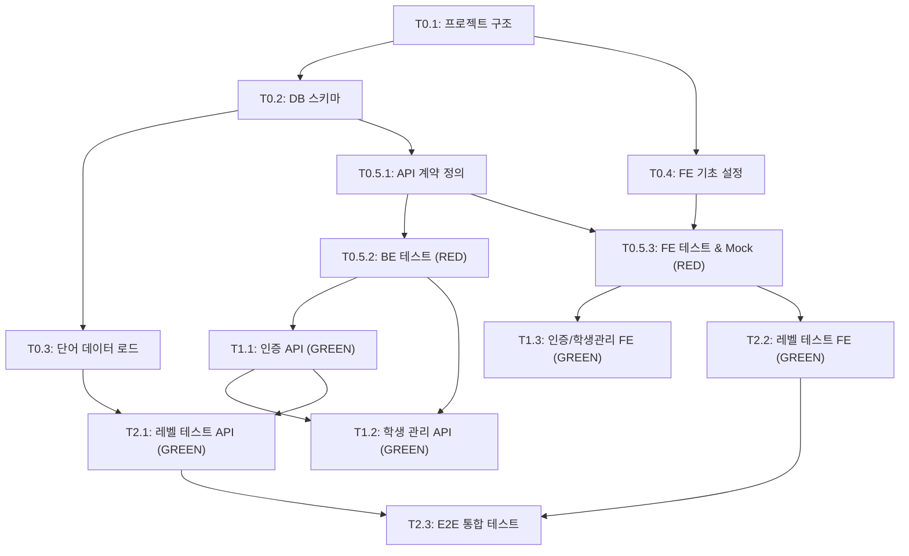

# TASKS: WordLvTest - AI 개발 파트너용 태스크 목록

## MVP 캡슐

| # | 항목 | 내용 |
|---|------|------|
| 1 | 목표 | 학생들의 영어 단어 실력을 빠르고 정확하게 테스트하여 레벨별로 분류 |
| 2 | 페르소나 | 학원 선생님(관리자) + 학생(테스트/학습자) |
| 3 | 핵심 기능 | FEAT-1: 단어 레벨 테스트 |
| 4 | 성공 지표 (노스스타) | 주 1회 이상 테스트 참여 학생 비율 |
| 5 | 입력 지표 | ① 신규 학생 테스트 완료율 ② 정기 테스트 참여율 |
| 6 | 비기능 요구 | 모바일+PC 반응형 웹 지원 |
| 7 | Out-of-scope | FEAT-2(리포트/통계), FEAT-3(학습 모드), 다크 모드, 수익화 |
| 8 | Top 리스크 | 학생들이 테스트에 흥미를 잃어 참여율이 낮아질 수 있음 |
| 9 | 완화/실험 | 친근한 톤의 피드백 + TTS로 발음 학습 요소 추가 |
| 10 | 다음 단계 | wordtest.xlsx 데이터 분석 및 레벨 체계 설계 |

---

## 기술 스택

| 영역 | 기술 |
|------|------|
| 백엔드 | FastAPI + Python 3.11+ + SQLAlchemy 2.0 + Alembic |
| 프론트엔드 | React 18 + Vite + TypeScript + TailwindCSS + Zustand |
| 데이터베이스 | PostgreSQL 15+ |
| 테스트 | pytest + Vitest + MSW + Playwright |
| 인프라 | Docker + Docker Compose |

---

## 마일스톤 개요

| 마일스톤 | Phase | 설명 | 주요 기능 |
|----------|-------|------|----------|
| M0 | Phase 0 | 프로젝트 셋업 | 디렉토리 구조, Docker, DB, 데이터 로드 |
| M0.5 | Phase 0 | 계약 & 테스트 설계 | API 계약 정의, 테스트 선행 작성 (RED) |
| M1 | Phase 1 | FEAT-0 공통 흐름 | 인증(JWT), 사용자 관리 (선생님/학생) |
| M2 | Phase 2 | FEAT-1 단어 레벨 테스트 | 테스트 엔진, 레벨 판정, 결과 화면 |

---

## M0: 프로젝트 셋업

### [] Phase 0, T0.1: 프로젝트 디렉토리 구조 생성

**담당**: frontend-specialist

**작업 내용**:
- 07-coding-convention.md의 디렉토리 구조에 따라 프로젝트 스캐폴딩
- frontend/: React + Vite + TypeScript 초기화 (`npm create vite@latest`)
- backend/: FastAPI 프로젝트 구조 생성
- contracts/: API 계약 디렉토리 생성
- Docker Compose 설정 (PostgreSQL + Backend + Frontend)

**산출물**:
- `frontend/package.json` (React + Vite + TypeScript)
- `frontend/tailwind.config.js` (TailwindCSS 설정)
- `frontend/tsconfig.json`
- `backend/requirements.txt` (FastAPI, SQLAlchemy, Alembic, pytest 등)
- `backend/app/main.py` (FastAPI 앱 엔트리)
- `docker-compose.yml` (PostgreSQL + 개발 환경)
- `.env.example`
- `.gitignore`

**완료 조건**:
- [ ] `docker compose up` 으로 PostgreSQL 구동 확인
- [ ] `cd frontend && npm run dev` 로 React 앱 실행 확인
- [ ] `cd backend && uvicorn app.main:app --reload` 로 FastAPI 실행 확인
- [ ] FastAPI `/docs` 에서 Swagger UI 접근 확인

---

### [] Phase 0, T0.2: 데이터베이스 스키마 & 마이그레이션

**담당**: database-specialist

**작업 내용**:
- 04-database-design.md 기반 SQLAlchemy 모델 정의
- Alembic 초기화 및 마이그레이션 파일 생성
- USER, WORD, TEST_SESSION, TEST_ANSWER, AUTH_TOKEN 테이블 생성

**산출물**:
- `backend/app/models/user.py` (USER 모델)
- `backend/app/models/word.py` (WORD 모델)
- `backend/app/models/test_session.py` (TEST_SESSION 모델)
- `backend/app/models/test_answer.py` (TEST_ANSWER 모델)
- `backend/app/models/auth_token.py` (AUTH_TOKEN 모델)
- `backend/app/core/database.py` (DB 연결 설정)
- `backend/alembic/` (마이그레이션 파일)

**완료 조건**:
- [ ] `alembic upgrade head` 로 모든 테이블 생성 확인
- [ ] PostgreSQL에서 테이블 구조 확인 (5개 테이블)
- [ ] 인덱스 생성 확인

---

### [] Phase 0, T0.3: wordtest.xlsx 데이터 로드 스크립트

**담당**: backend-specialist

**작업 내용**:
- data/wordtest.xlsx 파일 구조 분석
- openpyxl로 xlsx → WORD 테이블 로드 스크립트 작성
- 레벨별 단어 수 확인 및 검증

**산출물**:
- `backend/app/utils/load_words.py` (데이터 로드 스크립트)
- `backend/app/core/config.py` (환경 변수 설정)

**완료 조건**:
- [ ] `python -m app.utils.load_words` 실행으로 xlsx 데이터 DB 로드
- [ ] WORD 테이블에 데이터 삽입 확인
- [ ] 레벨별 단어 수 통계 출력

---

### [] Phase 0, T0.4: 프론트엔드 기초 설정

**담당**: frontend-specialist

**작업 내용**:
- TailwindCSS 설정 (05-design-system.md 컬러/타이포 반영)
- React Router v6 설정 (라우팅 구조)
- Axios 인스턴스 설정 (API 클라이언트)
- Zustand 스토어 기본 구조
- 기본 레이아웃 컴포넌트 (Header, Footer, Layout)

**산출물**:
- `frontend/src/styles/globals.css` (TailwindCSS 커스텀 토큰)
- `frontend/src/App.tsx` (라우팅 설정)
- `frontend/src/services/api.ts` (Axios 인스턴스)
- `frontend/src/stores/authStore.ts` (인증 스토어 스켈레톤)
- `frontend/src/components/ui/Button.tsx` (기본 버튼)
- `frontend/src/components/ui/Card.tsx` (기본 카드)
- `frontend/src/components/ui/Input.tsx` (기본 입력)
- `frontend/src/components/layout/Layout.tsx` (레이아웃)

**완료 조건**:
- [ ] TailwindCSS 커스텀 컬러 적용 확인 (Primary: #4F46E5)
- [ ] React Router 라우팅 동작 확인
- [ ] 기본 UI 컴포넌트 렌더링 확인

---

## M0.5: 계약 & 테스트 설계

### [] Phase 0, T0.5.1: API 계약 정의

**담당**: backend-specialist

**작업 내용**:
- 02-trd.md 섹션 8.3 API 엔드포인트 기반 계약 정의
- TypeScript 타입 + Pydantic 스키마 동시 작성
- 인증 API, 학생 관리 API, 테스트 API 계약

**산출물**:
- `contracts/types.ts` (공통 타입: User, Word, TestSession, TestAnswer)
- `contracts/auth.contract.ts` (인증 API 계약)
- `contracts/student.contract.ts` (학생 관리 API 계약)
- `contracts/test.contract.ts` (레벨 테스트 API 계약)
- `backend/app/schemas/auth.py` (Pydantic 인증 스키마)
- `backend/app/schemas/student.py` (Pydantic 학생 스키마)
- `backend/app/schemas/test.py` (Pydantic 테스트 스키마)
- `backend/app/schemas/word.py` (Pydantic 단어 스키마)

**완료 조건**:
- [ ] TypeScript 계약과 Pydantic 스키마 필드 일치 확인
- [ ] 모든 API 엔드포인트의 Request/Response 타입 정의 완료

---

### [] Phase 0, T0.5.2: 백엔드 테스트 선행 작성 (RED)

**담당**: test-specialist

**작업 내용**:
- T0.5.1 계약 기반 API 테스트 작성
- 모든 테스트가 실패하는 상태(RED) 확인
- pytest fixture 설정 (테스트 DB, 팩토리)

**산출물**:
- `backend/tests/conftest.py` (테스트 설정, DB fixture)
- `backend/tests/factories.py` (Factory Boy 팩토리)
- `backend/tests/api/test_auth.py` (인증 API 테스트)
- `backend/tests/api/test_student.py` (학생 관리 API 테스트)
- `backend/tests/api/test_level_test.py` (레벨 테스트 API 테스트)

**완료 조건**:
- [ ] `pytest backend/tests/ -v` 실행 시 모든 테스트 FAILED (RED 상태 정상)
- [ ] 최소 15개 이상 테스트 케이스 작성
- [ ] 인증/학생관리/레벨테스트 각 영역별 테스트 존재

---

### [] Phase 0, T0.5.3: 프론트엔드 테스트 & Mock 설정 (RED)

**담당**: test-specialist

**작업 내용**:
- MSW 핸들러 설정 (Mock API)
- T0.5.1 계약 기반 프론트엔드 테스트 작성
- Vitest + React Testing Library 설정

**산출물**:
- `frontend/src/mocks/handlers/auth.ts` (인증 Mock)
- `frontend/src/mocks/handlers/student.ts` (학생 관리 Mock)
- `frontend/src/mocks/handlers/test.ts` (레벨 테스트 Mock)
- `frontend/src/mocks/data/` (Mock 데이터)
- `frontend/src/mocks/server.ts` (MSW 설정)
- `frontend/src/__tests__/api/auth.test.ts` (인증 API 테스트)
- `frontend/src/__tests__/api/test.test.ts` (테스트 API 테스트)
- `frontend/vitest.config.ts` (Vitest 설정)

**완료 조건**:
- [ ] MSW Mock 서버 구동 확인
- [ ] `npm run test` 실행 시 Mock 기반 테스트 동작 확인
- [ ] 프론트엔드 테스트 RED 상태 확인

---

## M1: FEAT-0 공통 흐름 (인증 & 사용자 관리)

### [] Phase 1, T1.1: 인증 API 구현 RED→GREEN

**담당**: backend-specialist

**Git Worktree 설정**:
```bash
# 1. Worktree 생성
git worktree add ../wordlvtest-phase1-auth-be -b phase/1-auth-be
cd ../wordlvtest-phase1-auth-be

# 2. 작업 완료 후 병합 (사용자 승인 필요)
# git checkout main
# git merge phase/1-auth-be
# git worktree remove ../wordlvtest-phase1-auth-be
```

**TDD 사이클**:

1. **RED**: 테스트 확인 (T0.5.2에서 작성 완료)
   ```bash
   # 테스트 파일: backend/tests/api/test_auth.py
   pytest backend/tests/api/test_auth.py -v  # Expected: FAILED
   ```

2. **GREEN**: 최소 구현 (테스트 통과)
   ```bash
   # 구현 파일:
   # - backend/app/routes/auth.py (라우트)
   # - backend/app/services/auth_service.py (비즈니스 로직)
   # - backend/app/core/security.py (JWT, bcrypt)
   pytest backend/tests/api/test_auth.py -v  # Expected: PASSED
   ```

3. **REFACTOR**: 리팩토링 (테스트 유지)
   - 코드 정리, 에러 핸들링 개선
   - 테스트 계속 통과 확인

**작업 내용**:
- POST /api/v1/auth/register (선생님 계정 생성)
- POST /api/v1/auth/login (로그인 → JWT 발급)
- POST /api/v1/auth/refresh (토큰 갱신)
- JWT + Refresh Token 구현
- bcrypt 비밀번호 해싱
- 역할 기반 접근 제어 미들웨어 (teacher/student)

**산출물**:
- `backend/app/routes/auth.py`
- `backend/app/services/auth_service.py`
- `backend/app/core/security.py`
- `backend/app/core/dependencies.py` (인증 의존성)

**인수 조건**:
- [ ] 테스트 먼저 확인됨 (RED)
- [ ] `pytest backend/tests/api/test_auth.py -v` 모든 통과 (GREEN)
- [ ] JWT 토큰 발급/검증 동작
- [ ] 비밀번호 bcrypt 해싱 동작
- [ ] 커버리지 >= 80%

**완료 시**:
- [ ] 사용자 승인 후 main 브랜치에 병합
- [ ] worktree 정리: `git worktree remove ../wordlvtest-phase1-auth-be`

---

### [] Phase 1, T1.2: 학생 관리 API 구현 RED→GREEN

**담당**: backend-specialist

**의존성**: T1.1 (인증 API) - **인증 미들웨어 사용. T1.1 완료 후 진행 권장**

**Git Worktree 설정**:
```bash
git worktree add ../wordlvtest-phase1-student-be -b phase/1-student-be
cd ../wordlvtest-phase1-student-be
```

**TDD 사이클**:

1. **RED**: 테스트 확인
   ```bash
   pytest backend/tests/api/test_student.py -v  # Expected: FAILED
   ```

2. **GREEN**: 최소 구현
   ```bash
   # 구현 파일:
   # - backend/app/routes/student.py
   # - backend/app/services/student_service.py
   pytest backend/tests/api/test_student.py -v  # Expected: PASSED
   ```

3. **REFACTOR**: 정리

**작업 내용**:
- GET /api/v1/students (선생님: 본인 학생 목록 조회)
- POST /api/v1/students (선생님: 학생 계정 생성)
- PATCH /api/v1/students/{id} (선생님: 학생 정보 수정)
- DELETE /api/v1/students/{id} (선생님: 학생 삭제)
- 선생님만 접근 가능하도록 권한 체크

**산출물**:
- `backend/app/routes/student.py`
- `backend/app/services/student_service.py`

**인수 조건**:
- [ ] 테스트 먼저 확인됨 (RED)
- [ ] `pytest backend/tests/api/test_student.py -v` 모든 통과 (GREEN)
- [ ] teacher 역할만 학생 CRUD 가능
- [ ] 커버리지 >= 80%

**완료 시**:
- [ ] 사용자 승인 후 main 병합
- [ ] `git worktree remove ../wordlvtest-phase1-student-be`

---

### [] Phase 1, T1.3: 인증 & 학생관리 프론트엔드 RED→GREEN

**담당**: frontend-specialist

**의존성**: T0.5.3 (MSW Mock) - **Mock API로 독립 개발 가능**

**Git Worktree 설정**:
```bash
git worktree add ../wordlvtest-phase1-auth-fe -b phase/1-auth-fe
cd ../wordlvtest-phase1-auth-fe
```

**TDD 사이클**:

1. **RED**: 테스트 확인
   ```bash
   npm run test -- src/__tests__/ --run  # Expected: FAILED
   ```

2. **GREEN**: 최소 구현
   ```bash
   # 구현 파일:
   # - frontend/src/pages/auth/LoginPage.tsx
   # - frontend/src/pages/auth/RegisterPage.tsx
   # - frontend/src/pages/teacher/DashboardPage.tsx
   # - frontend/src/pages/teacher/StudentManagePage.tsx
   # - frontend/src/pages/student/MainPage.tsx
   # - frontend/src/stores/authStore.ts
   # - frontend/src/services/authService.ts
   # - frontend/src/services/studentService.ts
   npm run test -- src/__tests__/ --run  # Expected: PASSED
   ```

3. **REFACTOR**: 정리

**작업 내용**:
- 로그인 페이지 (선생님/학생 공용)
- 선생님 회원가입 페이지
- 선생님 대시보드 (학생 목록)
- 학생 관리 페이지 (추가/수정/삭제)
- 학생 메인 화면
- Zustand 인증 스토어 (토큰 관리, 로그인 상태)
- 라우트 가드 (역할별 접근 제어)

**산출물**:
- `frontend/src/pages/auth/LoginPage.tsx`
- `frontend/src/pages/auth/RegisterPage.tsx`
- `frontend/src/pages/teacher/DashboardPage.tsx`
- `frontend/src/pages/teacher/StudentManagePage.tsx`
- `frontend/src/pages/student/MainPage.tsx`
- `frontend/src/stores/authStore.ts`
- `frontend/src/services/authService.ts`
- `frontend/src/services/studentService.ts`
- `frontend/src/components/auth/RouteGuard.tsx`

**인수 조건**:
- [ ] MSW Mock 기반 테스트 통과 (GREEN)
- [ ] 로그인 → 역할별 대시보드 이동 동작
- [ ] 선생님: 학생 CRUD UI 동작
- [ ] 반응형 디자인 (모바일/PC)

**완료 시**:
- [ ] 사용자 승인 후 main 병합
- [ ] `git worktree remove ../wordlvtest-phase1-auth-fe`

---

## M2: FEAT-1 단어 레벨 테스트

### [] Phase 2, T2.1: 레벨 테스트 API 구현 RED→GREEN

**담당**: backend-specialist

**의존성**: T1.1 (인증) + T0.3 (단어 데이터) - **T1.1 완료 후 진행 권장**

**Git Worktree 설정**:
```bash
git worktree add ../wordlvtest-phase2-leveltest-be -b phase/2-leveltest-be
cd ../wordlvtest-phase2-leveltest-be
```

**TDD 사이클**:

1. **RED**: 테스트 확인
   ```bash
   pytest backend/tests/api/test_level_test.py -v  # Expected: FAILED
   ```

2. **GREEN**: 최소 구현
   ```bash
   # 구현 파일:
   # - backend/app/routes/test.py
   # - backend/app/services/test_service.py
   # - backend/app/services/level_engine.py (레벨 판정 로직)
   pytest backend/tests/api/test_level_test.py -v  # Expected: PASSED
   ```

3. **REFACTOR**: 정리

**작업 내용**:
- POST /api/v1/tests/start (테스트 시작 → 문제 생성)
- POST /api/v1/tests/{id}/answer (답변 제출)
- GET /api/v1/tests/{id}/result (테스트 결과 조회)
- 레벨 판정 엔진:
  - WORD 테이블에서 레벨별 문제 출제
  - 4지선다 선택지 생성 (정답 1개 + 오답 3개)
  - 점수 계산 및 레벨 판정 알고리즘
- 선생님: 학생별 테스트 결과 목록 조회

**산출물**:
- `backend/app/routes/test.py`
- `backend/app/services/test_service.py`
- `backend/app/services/level_engine.py`

**인수 조건**:
- [ ] 테스트 먼저 확인됨 (RED)
- [ ] `pytest backend/tests/api/test_level_test.py -v` 모든 통과 (GREEN)
- [ ] 레벨별 문제 출제 동작
- [ ] 4지선다 선택지 정상 생성
- [ ] 점수 계산 및 레벨 판정 정확
- [ ] 커버리지 >= 80%

**완료 시**:
- [ ] 사용자 승인 후 main 병합
- [ ] `git worktree remove ../wordlvtest-phase2-leveltest-be`

---

### [] Phase 2, T2.2: 레벨 테스트 프론트엔드 RED→GREEN

**담당**: frontend-specialist

**의존성**: T0.5.3 (MSW Mock) - **Mock API로 독립 개발 가능**

**Git Worktree 설정**:
```bash
git worktree add ../wordlvtest-phase2-leveltest-fe -b phase/2-leveltest-fe
cd ../wordlvtest-phase2-leveltest-fe
```

**TDD 사이클**:

1. **RED**: 테스트 확인
   ```bash
   npm run test -- src/__tests__/ --run  # Expected: FAILED
   ```

2. **GREEN**: 최소 구현
   ```bash
   # 구현 파일:
   # - frontend/src/pages/student/TestPage.tsx
   # - frontend/src/pages/student/ResultPage.tsx
   # - frontend/src/components/test/TestQuestion.tsx
   # - frontend/src/components/test/AnswerCard.tsx
   # - frontend/src/components/test/ProgressBar.tsx
   # - frontend/src/components/test/TTSButton.tsx
   # - frontend/src/components/test/ResultDisplay.tsx
   # - frontend/src/stores/testStore.ts
   # - frontend/src/services/testService.ts
   # - frontend/src/utils/tts.ts
   npm run test -- src/__tests__/ --run  # Expected: PASSED
   ```

3. **REFACTOR**: 정리

**작업 내용**:
- 테스트 시작 화면 (안내 → 시작 버튼)
- 문제 풀기 화면:
  - 영어 단어 표시 (큰 폰트)
  - 4개 선택지 (AnswerCard 컴포넌트)
  - TTS 발음 듣기 버튼 (Web Speech API)
  - 진행률 바 (5/20)
  - 정답/오답 피드백 (애니메이션)
  - 응원 메시지 표시
- 결과 화면:
  - 레벨 표시 (레벨 뱃지)
  - 점수 표시
  - 응원 메시지
  - 다시 풀기 버튼
- 선생님: 학생별 결과 조회 화면
- Zustand 테스트 스토어 (테스트 상태 관리)

**산출물**:
- `frontend/src/pages/student/TestPage.tsx`
- `frontend/src/pages/student/ResultPage.tsx`
- `frontend/src/pages/teacher/StudentResultPage.tsx`
- `frontend/src/components/test/TestQuestion.tsx`
- `frontend/src/components/test/AnswerCard.tsx`
- `frontend/src/components/test/ProgressBar.tsx`
- `frontend/src/components/test/TTSButton.tsx`
- `frontend/src/components/test/ResultDisplay.tsx`
- `frontend/src/components/test/LevelBadge.tsx`
- `frontend/src/stores/testStore.ts`
- `frontend/src/services/testService.ts`
- `frontend/src/utils/tts.ts`

**인수 조건**:
- [ ] MSW Mock 기반 테스트 통과 (GREEN)
- [ ] 테스트 진행 → 결과 화면 전체 플로우 동작
- [ ] TTS 발음 재생 동작 (Web Speech API)
- [ ] 정답/오답 피드백 UI 동작
- [ ] 응원 메시지 표시
- [ ] 반응형 디자인 (모바일/PC)

**완료 시**:
- [ ] 사용자 승인 후 main 병합
- [ ] `git worktree remove ../wordlvtest-phase2-leveltest-fe`

---

### [] Phase 2, T2.3: E2E 통합 테스트 & Mock 제거

**담당**: test-specialist

**의존성**: T2.1 + T2.2 완료 후 진행

**Git Worktree 설정**:
```bash
git worktree add ../wordlvtest-phase2-e2e -b phase/2-e2e
cd ../wordlvtest-phase2-e2e
```

**작업 내용**:
- MSW Mock 제거 → 실제 API 연결
- Playwright E2E 테스트 작성
- 주요 사용자 플로우 검증:
  1. 선생님 회원가입 → 로그인 → 학생 생성
  2. 학생 로그인 → 테스트 시작 → 문제 풀기 → 결과 확인
  3. 선생님 대시보드에서 학생 결과 확인

**산출물**:
- `frontend/e2e/auth.spec.ts` (인증 E2E)
- `frontend/e2e/level-test.spec.ts` (레벨 테스트 E2E)
- `frontend/e2e/teacher-dashboard.spec.ts` (선생님 대시보드 E2E)
- `frontend/playwright.config.ts`

**인수 조건**:
- [ ] `npx playwright test` 모든 E2E 테스트 통과
- [ ] 선생님 플로우 E2E 통과
- [ ] 학생 테스트 플로우 E2E 통과
- [ ] Mock 없이 실제 API로 동작

**완료 시**:
- [ ] 사용자 승인 후 main 병합
- [ ] `git worktree remove ../wordlvtest-phase2-e2e`

---

## 의존성 그래프



---

## 병렬 실행 가능 태스크

| 병렬 그룹 | 태스크 A | 태스크 B | 조건 |
|-----------|----------|----------|------|
| 그룹 1 | T0.2 (DB 스키마) | T0.4 (FE 기초 설정) | T0.1 완료 후 |
| 그룹 2 | T0.5.2 (BE 테스트) | T0.5.3 (FE 테스트) | T0.5.1 완료 후 |
| 그룹 3 | T1.1 (인증 BE) | T1.3 (인증 FE, Mock 사용) | T0.5.2/T0.5.3 완료 후 |
| 그룹 4 | T2.1 (테스트 BE) | T2.2 (테스트 FE, Mock 사용) | M1 완료 후 |

---

## 실행 순서 요약

```
Phase 0 (main 브랜치):
  T0.1 → [T0.2 || T0.4] → T0.3 → T0.5.1 → [T0.5.2 || T0.5.3]

Phase 1 (Git Worktree):
  [T1.1 || T1.3(Mock)] → T1.2

Phase 2 (Git Worktree):
  [T2.1 || T2.2(Mock)] → T2.3 (E2E)
```

총 태스크: **12개** | 예상 마일스톤: **4개** (M0, M0.5, M1, M2)
